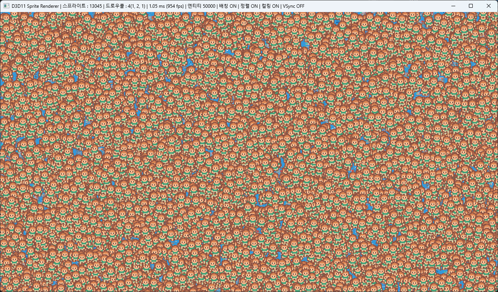
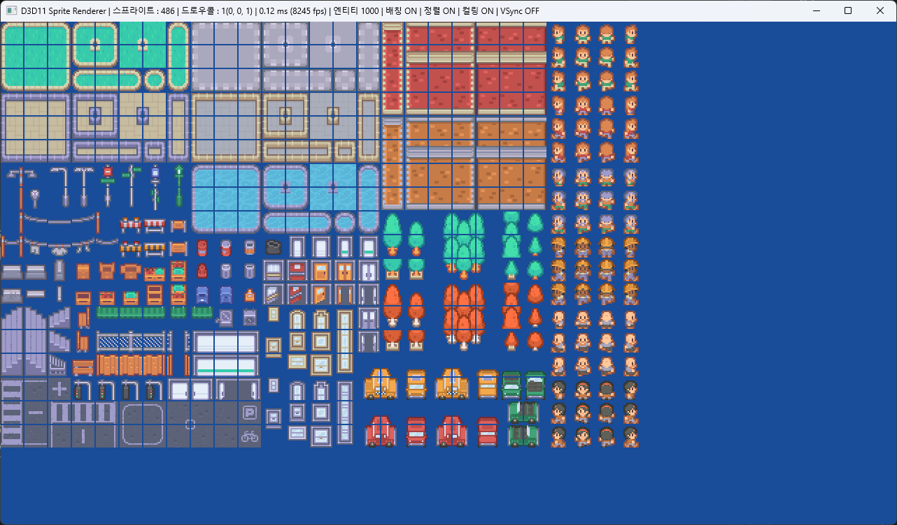

# DX11 2D Sprite Renderer

> Direct3D 11로 **엔진 없이 밑바닥부터** 구현한 2D 스프라이트 렌더러
> C++17 · Win32 · 1인 개발


상용 엔진(게임브리오 · Unity) 위에서 13년간 클라이언트를 개발해왔지만 그 아래의 렌더링
파이프라인을 직접 다뤄본 적은 없었습니다. **엔진이 대신 해주던 일을 직접 구현해보기 위해**
만든 프로젝트입니다.

단순히 "그려지는 것"에서 멈추지 않고, **병목을 계측 가능한 형태로 분해하고 원인별로
처방한 뒤 수치로 검증하는 것**을 목표로 했습니다.

---

## 📊 핵심 성과

50,000개 스프라이트 기준 — **드로우콜 50,000 → 4, 프레임 타임 27.6배 개선**

| 엔티티 | 최적화 없음 | 전체 적용 | 개선 |
|---:|---:|---:|---:|
| 1,000 | 0.46 ms | **0.12 ms** | 3.8배 |
| 5,000 | 2.38 ms | **0.14 ms** | 17.0배 |
| 10,000 | 4.55 ms | **0.21 ms** | 21.7배 |
| 50,000 | 28.19 ms (35 fps) | **1.02 ms (981 fps)** | **27.6배** |

<sub>RTX 3080 · 1280×720 · Release / x64 · VSync 해제 · 0.5초 누적 평균</sub>

측정 과정과 해석은 [ARCHITECTURE.md 4장](docs/ARCHITECTURE.md)에 정리했습니다.
**효과가 없어 되돌린 최적화**와 **두 최적화의 상호작용으로 생긴 아티팩트**도 함께 기록했습니다.



---

## ✨ 구현

**렌더링**
- Win32 창 + D3D11 초기화 (Device / DeviceContext / SwapChain)
- HLSL 런타임 컴파일, InputLayout 시그니처 검증
- stb_image 텍스처 로드, 직교 투영 2D 카메라
- 회전 · 스케일 · 틴트 · UV(아틀라스) · 블렌드 모드(알파 / 가산)
- 프레임 기반 스프라이트 애니메이션

**최적화**
- **스프라이트 배칭** — 정점을 CPU에 누적해 일괄 업로드, 드로우콜 1회로 병합
- **텍스처 그룹화** — 그리기 전 텍스처별로 묶어 상태 변경 최소화 (O(n) 버킷 분류)
- **화면 밖 컬링** — 뷰포트 밖 스프라이트를 정점 생성 단계에서 제외

**계측**
- 플러시 **원인별** 카운터 (텍스처 전환 / 버퍼 포화 / 배치 마감)
- 실시간 프레임 타임 표시, 각 최적화 개별 토글

한 장의 아틀라스에서 486종의 타일을 **드로우콜 1회**로 그린 화면:



---

## 🎮 조작

실행 중에 각 최적화를 켜고 끄며 효과를 직접 비교할 수 있습니다.
현재 상태와 통계는 **창 제목 표시줄**에 실시간으로 표시됩니다.

| 키 | 기능 |
|---|---|
| `F1` | 배칭 on/off |
| `F2` | 텍스처 정렬 on/off |
| `F3` | 화면 밖 컬링 on/off |
| `F4` | VSync on/off |
| `1` `2` `3` `4` | 엔티티 수 — 1,000 / 5,000 / 10,000 / 50,000 |
| 방향키 | 카메라 이동 |

```
스프라이트 : 13033 | 드로우콜 : 4(1, 2, 1) | 1.02 ms (981 fps)
| 엔티티 50000 | 배칭 ON | 정렬 ON | 컬링 ON | VSync OFF
```

드로우콜 옆 괄호는 **플러시가 일어난 원인별 횟수**입니다. 드로우콜이 몇 개인지보다
**왜 끊겼는지**가 처방을 결정하기 때문에 나눠서 셉니다.

---

## ⚙️ 빌드

```
1. Visual Studio 2022로 DX11SpriteRenderer.sln 열기
2. 구성: Release / 플랫폼: x64
3. F5 실행
```

셰이더와 에셋은 빌드 후 이벤트로 출력 폴더에 복사되며, 실행 파일 단독으로 동작합니다.
외부 라이브러리 설치나 패키지 복원이 필요 없습니다.

> **성능을 측정하실 때는 반드시 Release 빌드로 실행하세요.** Debug는 STL 반복자 검사 때문에
> `std::sort`와 벡터 접근이 몇 배 느려 수치가 의미를 잃습니다.

---

## 📁 코드 구조

```
src/
├─ main.cpp
├─ core/
│  ├─ Window.*        Win32 창과 메시지 루프
│  ├─ Timer.*         QueryPerformanceCounter 기반 델타타임
│  └─ App.*           초기화 · 게임 루프 · 데모 씬
├─ render/
│  ├─ GraphicsDevice.*  D3D11 초기화, 프레임 시작/종료
│  ├─ Shader.*          HLSL 런타임 컴파일, InputLayout
│  ├─ Texture.*         이미지 로드와 SRV
│  ├─ Camera2D.*        직교 투영, 가시 영역 계산
│  ├─ SpriteBatch.*     ★ 배칭 · 플러시 · 통계
│  ├─ AnimationClip.h   애니메이션 데이터
│  ├─ AnimatedSprite.*  재생 상태
│  └─ Vertex.h
└─ shaders/
   ├─ Sprite.vs.hlsl
   └─ Sprite.ps.hlsl
```

`SpriteBatch`가 핵심입니다. `Draw`는 GPU를 전혀 건드리지 않고 CPU 메모리에 정점을 쌓기만
하며, 실제 제출은 텍스처가 바뀌거나 버퍼가 찰 때만 일어납니다.

---

## 📄 문서

| 문서 | 내용 |
|---|---|
| [ARCHITECTURE.md](docs/ARCHITECTURE.md) | 설계 결정과 그 근거, 최적화 측정 결과, 회고 |
| [LEARNING-NOTES.md](docs/LEARNING-NOTES.md) | 구현하며 막혔던 지점을 개념 단위로 정리 |

설계 문서에는 **성공한 최적화뿐 아니라 채택하지 않은 최적화와 현재 구현의 한계**도
함께 적었습니다.

---

## 🖼️ 에셋 안내

- 타일셋 · 캐릭터: [Kenney.nl](https://kenney.nl) — CC0
- 이미지 디코딩: [stb_image](https://github.com/nothings/stb) — Public Domain

에셋은 렌더러 동작 확인을 위한 것이며, 이 저장소에서 봐주셨으면 하는 부분은
**렌더링 파이프라인 구현과 최적화 과정**입니다.

---

## 👤 개발자

**sisibo** — Game Client Programmer
📧 sisibo.dev@gmail.com
